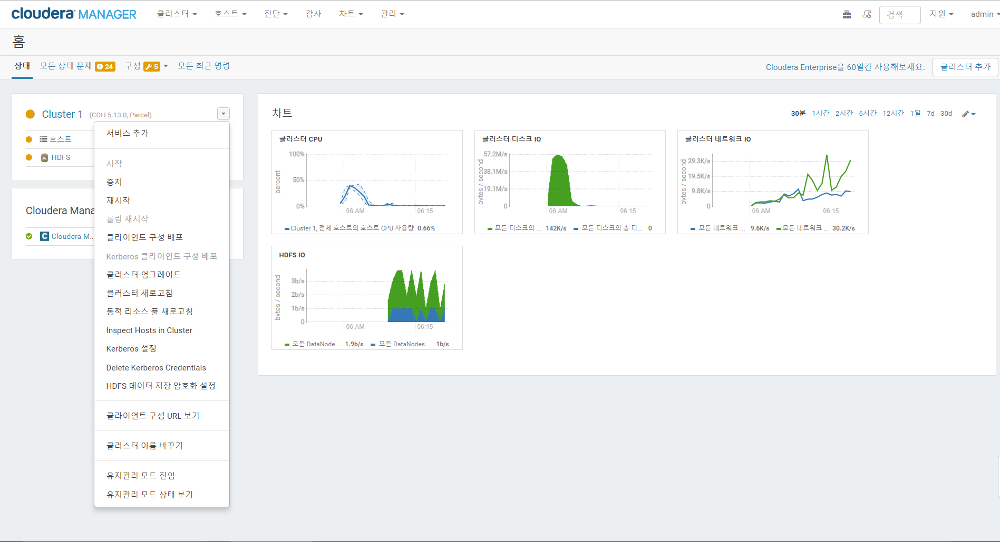
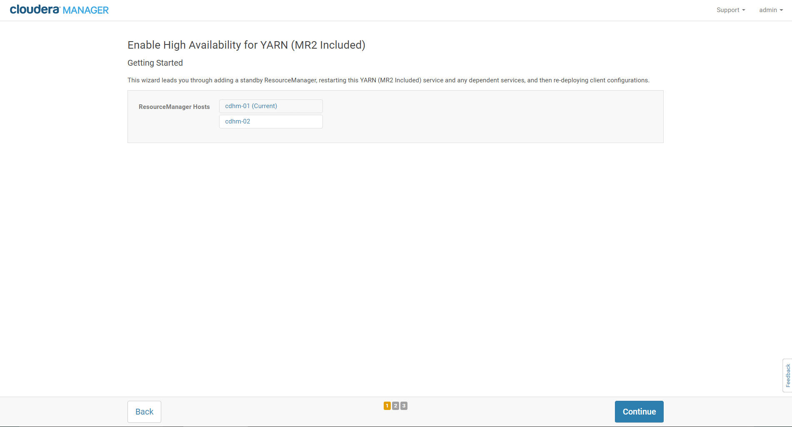

출처 : https://www.cloudera.com/documentation/enterprise/5-12-x/topics/cm_ig_install_path_b.html  
# Installation Using Cloudera manager with Parcels
- [installation_of_CDH_initialzing_node](installation_of_CDH_initializing_node.md)를 먼저 수행하고 진행해야 한다.
- 위 내용을 완료하면 cluster1이라는 이름의 클러스터가 생성된다.
- cluster1 drop button > Add Service를 클릭한 뒤 자신이 원하는 서비스를 선택한다(HDFS/YARN)
- CDH의 hadoop관련 모든 서비스는 **HDFS** 가 먼저 설치 되어야 한다(kafaka, zookeeper 및 client software 제외)  

## Add service(HDFS)

### Select the service to install   
 - HDFS 선택  
 

 > 주의!  
 > 각 서비스별 종속관계가 있으므로 미리 확인 후 선택해야 함  
 > CDH 5의 경우 YARN이 default이다.    
 > HDFS HA enable을 위해서는 zookeeper가 미리 설치되어야 한다.  

 - HDFS 기본 설정 구성  
   
 

 - 설치  
   
   

 - 완료  
   
 > Tip!  
 > namenode, datanode 상세 설정이 필요한 경우 설치가 완료된 후에 설정 변경을 하면 된다.  
 > namenode HA를 위해서 zookeeper로 미리 설치하여야 한다.

 - HDFS master HA enable(HDFS > Actions > Enable High Availability)  
   

 - namespace, secondary namenode, journalnode 지정  
   

 - secondary namenode, journalnode 설정  
   

 - 배포 및 시작  
   

 - 완료  
   

 > Troubleshotting for installation of HDFS
  - [Troubleshotting](https://www.cloudera.com/documentation/enterprise/5-12-x/topics/cm_ig_troubleshooting.html)
  - [Configuring single user mode](https://www.cloudera.com/documentation/enterprise/latest/topics/install_singleuser_reqts.html)
  - [Permission Requirement](https://www.cloudera.com/documentation/enterprise/latest/topics/cm_ig_permissions.html)
  - [namenode format fail](https://community.cloudera.com/t5/Cloudera-Manager-Installation/Formatting-namenode-failed-java-io-IOException-Cannot-create/td-p/38354)

## Add service(YARN)

### Select the service to install
- YARN 선택  
  
  

> 주의!  
> 각 서비스별 종속관계가 있으므로 미리 확인 후 선택해야 함  
> CDH 5의 경우 YARN이 default이다.  

- YARN 기본 설정 구성  
  
  

- 설치  
  

- 완료  
  
> Tip!  
> resourcemanager, nodemanager 상세 설정이 필요한 경우 설치가 완료된 후에 설정 변경을 하면 된다.

- YARN master HA enable(YARN > Actions > Enable High Availability)  
  

- 배포 및 시작  
  

- 완료  
  
