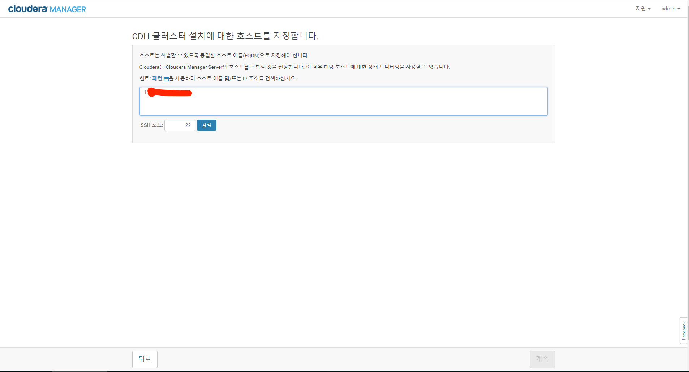
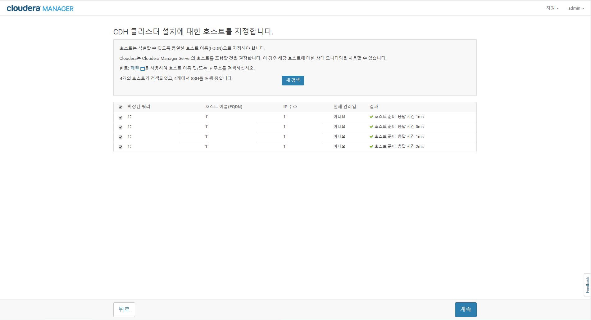
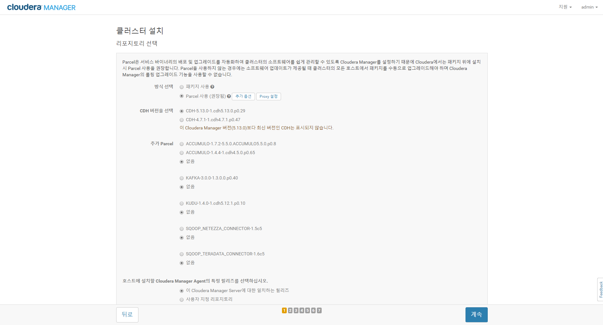
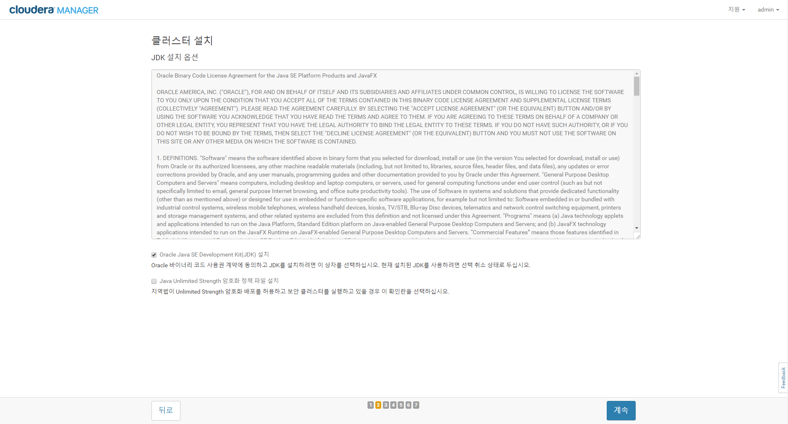
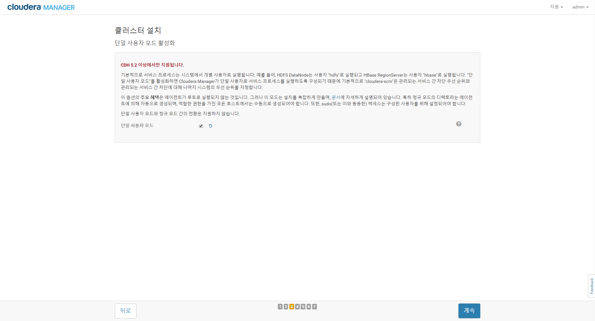
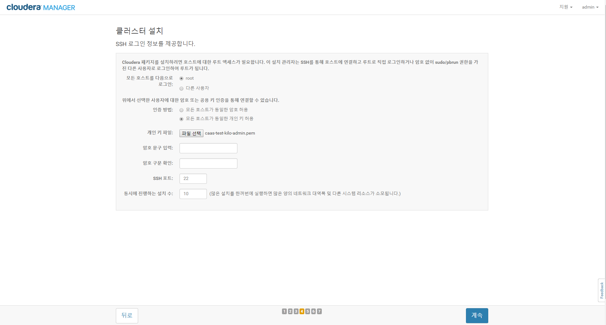
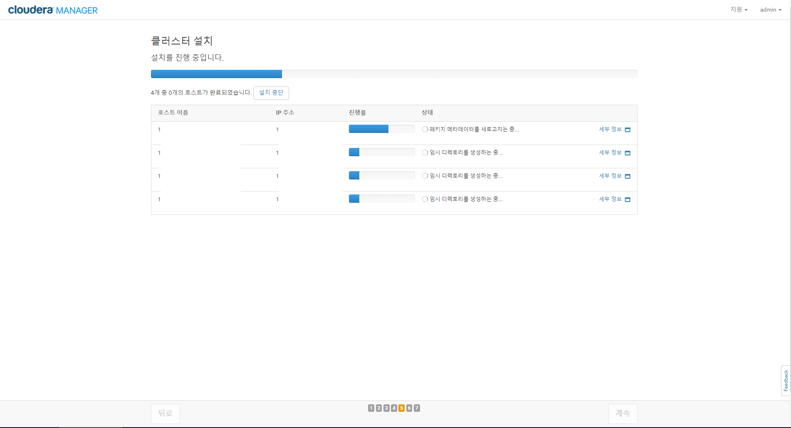
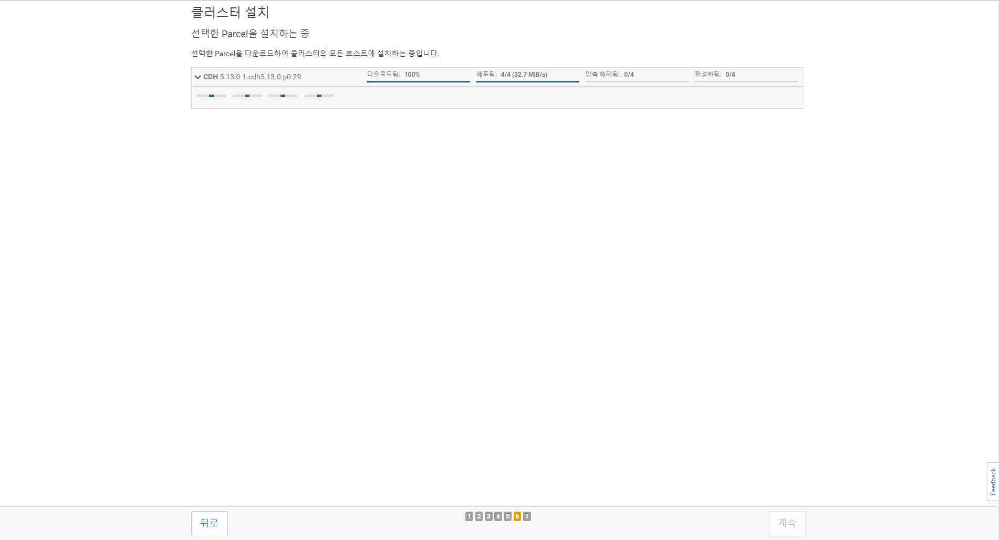
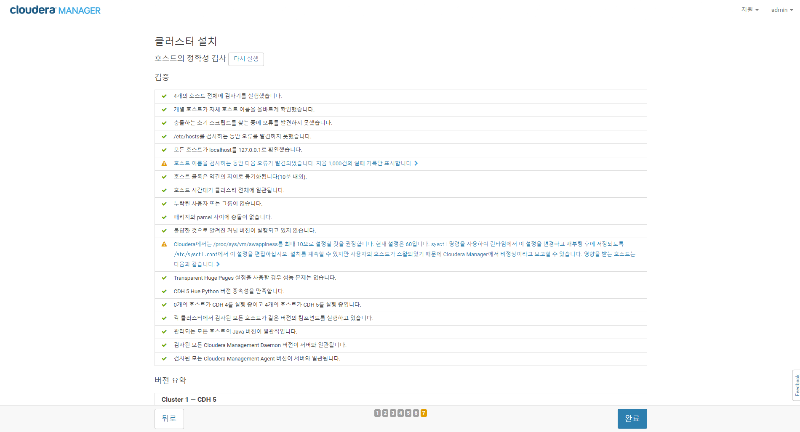

출처 : https://www.cloudera.com/documentation/enterprise/5-12-x/topics/cm_ig_install_path_b.html  

# Installation Using Cloudera manager with Parcels
## Initializing cloudera manager
 - http://server_host:7180 접속(accound : admin/password : admin)
 - admin계정은 변경 불가(password는 변경가능)
 - login하면 라이센스 정책에 맞게 선택 [라이센스정책](https://www.cloudera.com/documentation/enterprise/5-12-x/topics/cm_ig_install_path_b.html#id_abd_dtm_25)


## Choose Cloudera manager edition
 - [라이센스 정책](https://www.cloudera.com/documentation/enterprise/5-12-x/topics/cm_ig_install_path_b.html#id_abd_dtm_25)에 맞게 사용
 - 우리 환경은 cloudera express를 사용  
 


## Cluster node initialization using ansible
### Install Ansible and requirement
 - install ansible
 ```bash
## Requirement
ansible >= 2.3
jinja2(python-jinja2)
PyYAML(python-yaml)
paramiko(python-paramiko)
pycrypto >= 2.6 (python-crypto)
setuptools(python-setuptools)
# install Requirement
$ sudo apt-get install -y python-jinja2 python-yaml python-paramiko python-crypto python-setuptools  
# Ansible using apt repo
$ sudo apt-get install ansible  or
# Ansible using tarball
$ tar xvfz ansible-2.3.2.0-1.tar.gz
$ cd ansible-2.3.2.0-1
$ sudo python setup.py build
$ sudo python setup.py install
$ ansible --version
ansible 2.3.2.0
  config file =
  configured module search path = Default w/o overrides
  python version = 2.7.12 (default, Nov 19 2016, 06:48:10) [GCC 5.4.0 20160609]
```

### Ansible playbook 실행
 - cluster node 들의 서버 설정을 위한 ansible-playbook
 - 상세 내용은 README 참조
 - inventory.cfg 수정
 ```bash
 # inventory 수정
 $ vi inventory/inventory.cfg
 ## add hosts in [all] section
 ## add ansible option in [all:vars] section
 $ ansible-playbook -i inventory/inventory.cfg -b -v
 ```

## Host 등록
### Choose cloudera manager hosts  
 - 우리 환경은 parcels를 이용하기 때문에 노드를 등록 하기만 하면 cm에서 조회하여 찾는다.
 - 설치시 ip, hostname등 을 range로 지정가능 10.1.1.[1-4]
 - 지정한 노드들은 모두 ssh 접속이 되어야 한다.  
   
   

 > Troubleshooting
  - cloudera manager가 hostname 기준으로 명령어를 실행하므로 모든 노드에 hosts 파일을 미리 배포해야 함(dns 구성이 안되어 있을 경우에 해당)


### Choose the software installation type and install software
 - **아래의 과정을 완료하면 cluster1 이름의 클러스터가 생성됨**
 - 우리 환경은 parcels을 이용한다.  
    

 - oracle JDK 설치를 선택  
   

 - 단일 사용자 모드 비활성화(서비스별 프로세스 실행계정 분리)  
   
 > Tip
  - 서비스별 사용자를 분리할 경우, 보안성은 높으나 cloudera-scm 계정에 sudo 권한을 모든 서버에 할당해야 한다.

 - host 접속 정보 입력  
   

 - 설치 진행  
   

 - pacels 설치  
   
   


