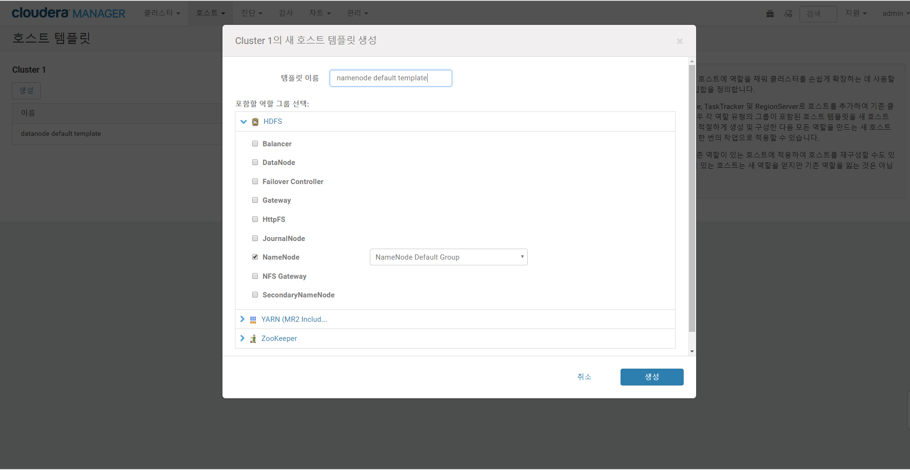

# Installation Using Cloudera manager with Parcels

## HDFS
 - [hdfs-site.xml - default](http://archive.cloudera.com/cdh5/cdh/5/hadoop/hadoop-project-dist/hadoop-hdfs/hdfs-default.xml)  
 - [core-site.xml - default](http://archive.cloudera.com/cdh5/cdh/5/hadoop/hadoop-project-dist/hadoop-common/core-default.xml)  

### Service configuration(hdfs-site.xml, core-site.xml)
#### dfs data dirs
 | field | value |
 |-------|-------|
 | dfs.name.dirs | /dfs/nn |
 | fs.checkpoint.dir | /dfs/sn(secondary namenode)|
 | dfs.data.dirs | /dfs/dn |
 | dfs.journalnode.edits.dirs | /dfs/jn |

#### dfs blocks
| field | value |
|-------|-------|
| dfs.block.size | 128MiB |
| dfs.replication | 3 |
| dfs.replication.min | 1 |

#### fs option(core-site.xml)
| field | value |
|-------|-------|
| fs.permissions.umask-mode | 022 |
| fs.trash.interval | 1 |
| hadoop.security.group.mapping | org.apache.hadoop.security.ShellBasedUnixGroupsMapping |

#### node option
| field | value |
|-------|-------|
| dfs.datanode.hdfs-blocks-metadata.enabled | TRUE |
| dfs.domain.socket.path | /var/run/hdfs-sockets/dn |

#### HA
| field | value |
|-------|-------|
| NameNode Nameservice | camp |
| ZooKeeper service | zookeeper(cm zookeeper) |

#### Service Port(default)
| field | value |
|-------|-------|
| dfs.namenode.rpc-address | 8020 |
| dfs.namenode.servicerpc-address | 8022 |
| dfs.namenode.http-address | 50070 |
| dfs.namenode.https-address | 50470 |

### 역할 그룹(Role groups)
 - 인스턴스(노드)의 역할별로 그룹하기 위한 정보, 기본적인 그룹은 아래와 같다.
 - 서비스 설치시 생성되는 그룹(HDFS)  
  - Balance Default group
  - Datanode Default group
  - Failover Controller Default group
  - Journalnode Default group
  - Namenode Default group  

> Note   
 > 다른 h/w 구성의 인스턴스(노드)가 추가될 경우 새로운 역할 그룹을 만들어 호스트 템플릿과 매핑하여 사용하면 된다.  

### 호스트 템플릿(Host template)
 - 새 인스턴서(노드)에 역할을 채워 클러스터를 손쉽게 확장하는데 사용할 수 있는 group의 template이다.
 - 호스트 > 호스트템플릿 > 생성버튼 클릭  
 

## YARN
 - [yarn-site.yml - default](https://archive.cloudera.com/cdh5/cdh/5/hadoop/hadoop-yarn/hadoop-yarn-common/yarn-default.xml)  
 - [yarn tuning guide](https://www.cloudera.com/documentation/enterprise/5-12-x/topics/cdh_ig_yarn_tuning.html)

### Service configuration(yarn-site.xml, mapred-site.xml)
#### yarn data dirs
 | field | value |
 |-------|-------|
 | yarn.nodemanager.local-dir | /yarn/nm |
 | yarn.nodemanager.log-dirs | /yarn/container-logs|  

#### yarn options
 | field | value |
 |-------|-------|
 | yarn.acl.enable | TRUE |
 | yarn.nodemanager.log-dirs | /yarn/container-logs|
 | yarn.client.failover-sleep-base-ms | 100 |
 | yarn.client.failover-sleep-max-ms | 2000 |
 | yarn.log-aggregation.retain-seconds | 7day |
 | yarn.log-aggregation-enable | TRUE |
 | yarn.resourcemanager.amliveliness-monitor.interval-ms | 1000 |
 | yarn.resourcemanager.nm.liveness-monitor.interval-ms | 1000 |
 | yarn.resourcemanager.recovery.enabled | TRUE |
 | yarn.resourcemanager.scheduler.class | .scheduler.fair.FairScheduler |
 | yarn.resourcemanager.store.class | org.apache.hadoop.yarn.server.resourcemanager.recovery.ZKRMStateStore |
 | yarn resource allocation | [yarn-tuning-guide.xlsx] 참고 |

#### HA
 | field | value |
 |-------|-------|
 | yarn.resourcemanager.cluster-id | yarnRM |
 | ZooKeeper service | zookeeper(cm zookeeper) |

#### Service Port(default)
 | field | value |
 |-------|-------|
 | yarn.resourcemanager.address | 8032 |
 | yarn.resourcemanager.scheduler.address | 8030 |
 | yarn.resourcemanager.resource-tracker | 8031 |
 | yarn.resourcemanager.admin.address | 8033 |
 | yarn.resourcemanager.webapp.address | 8088 |
 | yarn.resourcemanager.webapp.https.address | 8090 |

> Note  
 > yarn-tuning-guide.xlsx 파일의 내용을 이용하여 자신의 클러스터에 맞는 nodemanager, resourcemanager 리소스를 계산할 수 있다.

### 역할 그룹(Role groups)
- 인스턴스(노드)의 역할별로 그룹하기 위한 정보, 기본적인 그룹은 아래와 같다.
- 서비스 설치시 생성되는 그룹(YARN)
 - JobHistory server default group
 - NodeManager default group
 - ResourceManager default group   

> Note   
 > 다른 h/w 구성의 인스턴스(노드)가 추가될 경우 새로운 역할 그룹을 만들어 호스트 템플릿과 매핑하여 사용하면 된다.  

### 호스트 템플릿(Host template)
- 새 인스턴서(노드)에 역할을 채워 클러스터를 손쉽게 확장하는데 사용할 수 있는 group의 template이다.
- 호스트 > 호스트템플릿 > 생성버튼 클릭    

### 동적 리소스풀 구성(Dynamic resource pool)
 - 클러스터 > 동적 리소스 풀 구성 클릭  

